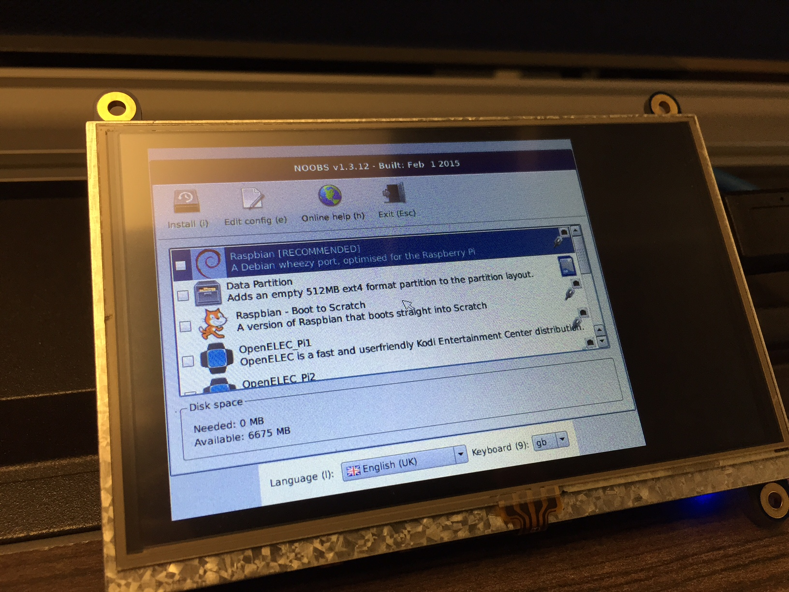
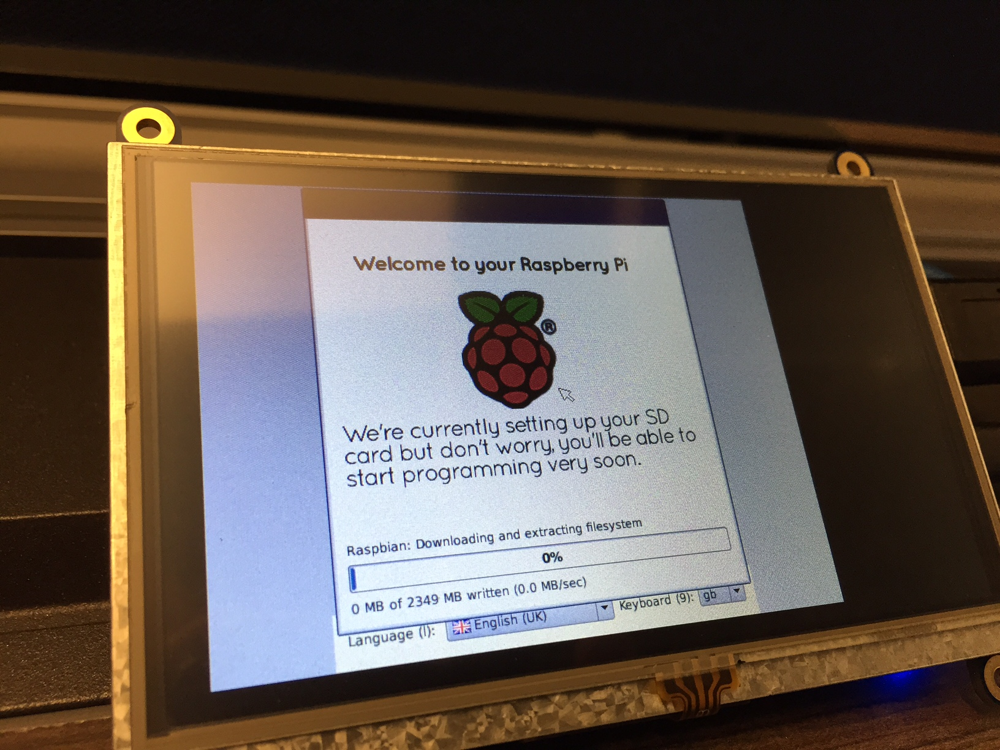

###Step 8: Select Raspbian
The first screen you will see when the Pi first turns boots up from the CanaKit MicroSD card will prompt you to select which operating system to install. Select Raspbian (RECOMMENDED) from the top of the list. This will begin a 10-15 minute installation of Raspbian.

###Step 9: Set Keyboard Layout
At the bottom of the installation progress screen, you can select the language and keyboard layout. Choose English (USA) for the language and US for the keyboard. If you leave this setting at its default, English (UK), you will find several keys on the keyboard switched (such as the @ and “ keys). If you forget to change the keyboard layout, [read](http://blog.initialstate.com/messed- up-rpi-keyboard/) for instructions on how to correct this later.

###Step 10: Starting the GUI
Once your Pi has completed the Raspbian installation, it will boot to a command prompt. By default, the administrator username is `pi` and the password is `raspberry`. If prompted, enter the username/password. Once at a command prompt, type `startx` and hit enter to start the GUI.

[<< Part 1: Unboxing to Power-On](Part-1.-Unboxing-to-Power-On) - [Part 1: LCD Setup >>](Part-1.-LCD-Setup)