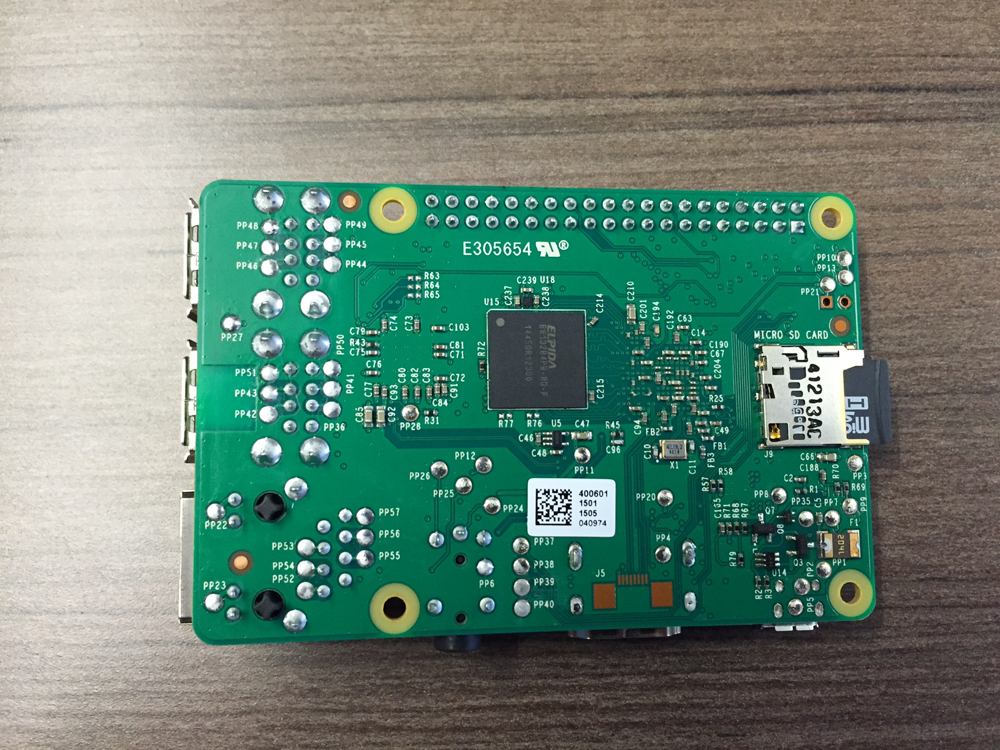

###Step 1: Insert MicroSD

The Raspberry Pi will boot from the operating system (o/s) installed on the MicroSD card. The CanaKit Ultimate Starter Kit includes a MicroSD card pre-loaded with the operating system that we will use, Raspbian. Raspbian is a version of Linux optimized for Raspberry Pi. Insert the MicroSD card into the Raspberry Pi.

###Step 2: Insert Into Case
Place the Raspberry Pi inside the clear plastic CanaKit case. This will protect the Raspberry Pi from electrostatic discharge (ESD). Never touch an exposed circuit board without being properly grounded.

###Step 3: Plug In Keyboard + Mouse
Plug in the wireless keyboard/mouse USB receiver into one of the Pi’s USB ports. The Pi should auto-detect the keyboard/mouse.

###Step 4: Connect Power For LCD
Connect the small end of the MicroUSB cable into the 5” LCD. Connect the large end of the MicroUSB cable into one of the Pi’s USB ports. This will power the LCD from the Pi. (*Note, do not plug the USB WiFi adapter yet as the LCD will not receive enough power from the Pi to turn on until Step 14.)

###Step 5: Connect HDMI
Connect the HDMI cable between the 5” LCD and the Pi.

###Step 6: Connect to Network
Connect the network cable to the Ethernet port of the Pi. If you are going to use the USB WiFi adapter, do not plug it in until Step 14 or the LCD will not turn on.

###Step 7: Power On
Plug in the MicroUSB power supply into the Pi to turn it on.

[<< Part 1: Equipment](Part-1.-Equipment) - [Part 1: Initial Setup](Part-1.-Initial-Setup)