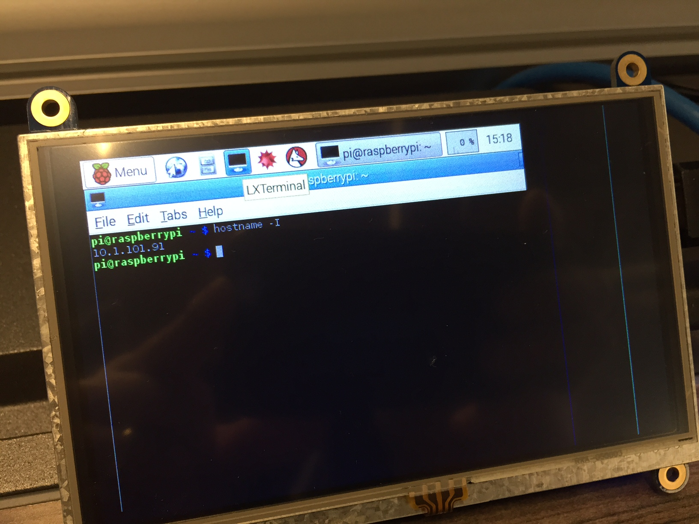
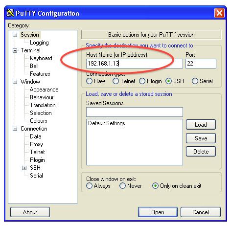
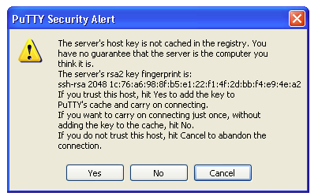
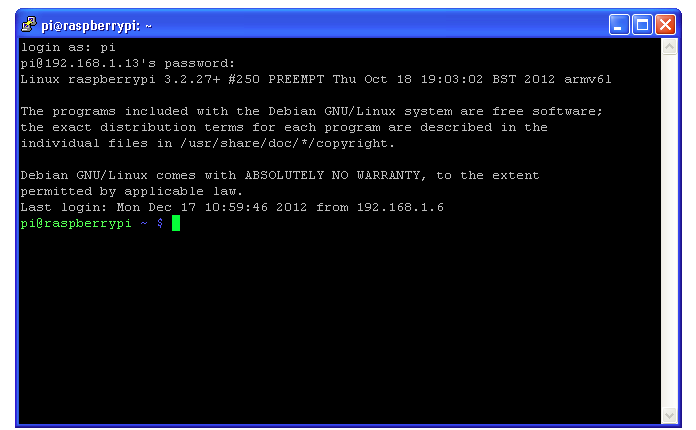

In order to remotely log into your Pi from your laptop, you will need your Pi’s IP address. 

### Step 1: Get IP Address of Pi
Go to your Pi’s command prompt by clicking on the LXTerminal icon at the top toolbar. Enter the command:

```
$ hostname -I
```

> **Bash Beginner Tip**: The `$` sign in the command above denotes the start of a bash command, you don't actually type this when typing in bash. In fact, if you look at your raspberry pi's terminal or your other machine's terminal, you'll see the dollar sign is already to the left of the cursor. If you ever see a `#` instead of a dollar sign before the bash command, it means that the current bash context has elevated, super user privileges, similar to prefixing each command with `sudo`.

The IP address will be returned to the screen. Write your IP address down for use throughout this workshop. In the screenshot above, the Pi’s IP address is 10.1.101.91.

### Step 2: Setup SSH

We will be using the `ssh` protocol to communicate with our Pi over the local network.
> SSH stands for Secure Shell and allows us to remotely log into our Pi and run commands.

If you're on Linux of Mac, the `ssh` tool comes standard. If you're on Windows, you'll need a client. We recommend [PuTTY](http://www.putty.org/) which can be downloaded from putty.org.

### Step 3: (Lunix/Mac) SSH

####a. Open a Terminal
On your laptop, open up your favorite terminal (if you don't have a favorite, just use the built in Terminal app).

####b. SSH
Enter the command (replace `<ip_address>` with the IP address of the pi):

```
$ ssh pi@<ip_address>
```

This will attempt to connect to your Pi using the specified IP address and login with the username ‘pi’. 

####c. Accept fingerprint
The first time you login to your Pi, you will receive a message similar to the following:

```
$ ssh pi@10.1.101.91
The authenticity of host '10.1.101.91 (10.1.101.91)'
 can't be established. RSA key fingerprint is
 b2:03:15:12:71:f2:6c:5c:2e:82:69:cc:5c:e8:81:54. Are
 you sure you want to continue connecting (yes/no)?
```

Enter `yes`, then enter your password. 
> The default password is `raspberry` for a new Pi.
> The default admin username is `pi`

After you get here, you can skip to **After connecting**.

### Step 3: (Windows) SSH with PuTTY

####a. Install PuTTY
If you do not have PuTTY or a similar tty application for Windows, you'll need to install it from http://www.putty.org/

####b. Configure PuTTY session
Start the `putty.exe` and in the "Host Name (or IP address)" we'll put the Pi's IP address. Leave the "Port" set to 22 (this is the default port for the SSH protocol). After configuring, click "Open".



>image sourced from [adafruit](https://learn.adafruit.com/adafruits-raspberry-pi-lesson-6-using-ssh/ssh-under-windows)

####c. Accept fingerprint
If this is your first time connecting to the Pi from your computer, you'll see a Security Alert similar to the following asking you to verify and accept the Pi's RSA fingerprint. Click "Yes".



>image sourced from [adafruit](https://learn.adafruit.com/adafruits-raspberry-pi-lesson-6-using-ssh/ssh-under-windows)

####d. Successful SSH
After connecting, you should see a terminal-like window similar to the following



>image sourced from [adafruit](https://learn.adafruit.com/adafruits-raspberry-pi-lesson-6-using-ssh/ssh-under-windows)

### Step 4: After connecting
If successful, you will see something similar to the following on your screen:

```
Linux raspberrypi 3.18.5-v7+ #225 SMP PREEMPT Fri Jan 30 18:53:55 GMT 2015 armv7l

The programs included with the Debian GNU/Linux system are free software; the exact distribution terms for each program are described in the
individual files in /usr/share/doc/*/copyright.

Debian GNU/Linux comes with ABSOLUTELY NO WARRANTY, to the extent permitted by applicable law.
Last login: Wed Feb 25 22:24:20 2015 from 10.0.0.41
pi@raspberrypi ~ $
```

This means that you are now remotely connected to your Pi and ready to tell it what to do.

> **TIP**: The IP address of your Pi can change based on your router’s settings. If you try to SSH into your Pi and fail to get a connection, the Pi’s IP address may have changed. There are several ways to get the current IP address of your Pi. The most straightforward method is to hook a keyboard and monitor up to your Pi and run the hostname –I command. Your router may have a built-in web server that you can log into to see the IP addresses of all connected devices. A short article that discusses different ways to discover your Pi’s IP address can be [found here](http://www.raspberrypi.org/documentation/troubleshooting/hardware/networkin g/ip-address.md).


[<< Part 2. Hello World](Part-2.-Hello-World) - [Part 2. Python + Nano >>](Part-2.-Python+Nano)