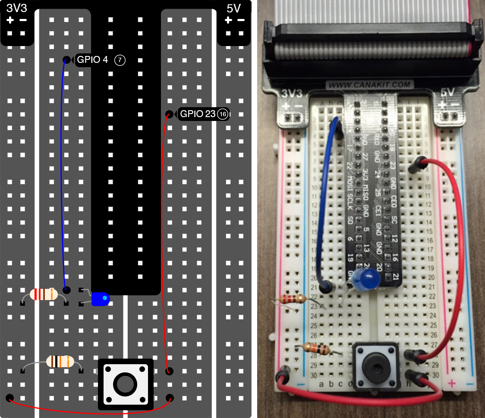

We have driven a button input into our Pi. Now let’s control a LED output from our Pi. Make the following additions to your breadboard (after you have powered down your Pi!!).



> Make sure to connect the long end of the LED to the 220 ohm resistor and the short end of the LED to pin 4 of the Pi.

The Python script that we will use for this circuit will turn the LED on and off when a button is pressed. Once your circuit is built, power your Pi back on, ssh into it, and cd into the piot directory. The Python script we will use is called `button-led.py`.

```
$ cd piot
$ nano button-led.py
```

**button-led.py**

```python
# Import library that lets you control the Pi's GPIO pins
import RPi.GPIO as GPIO 
# Import time for delays 
from time import sleep

# Disables messages about GPIO pins already being in use
GPIO.setwarnings(False)
# Numbering scheme that corresponds to breakout board and pin layout
GPIO.setmode(GPIO.BCM)

pinNumLED = 4
pinNumBTN = 23
# Specifies that pinNumLED will be an output
GPIO.setup(pinNumLED, GPIO.OUT)
# Specifies that pinNumBTN will be an input
GPIO.setup(pinNumBTN, GPIO.IN)

btnOn = False
prevInput = 0

while True:
    # Get the state of the button input
    btnInput = GPIO.input(pinNumBTN)
    # Debounce the button
    if ((not prevInput) and btnInput):
        # Toggle the button on and off
        btnOn = not btnOn
    prevInput = btnInput
    sleep(0.05)
    
    if btnOn:
        # Turn the LED on
        GPIO.output(pinNumLED, GPIO.HIGH)
    else:
        # Turn the LED off
        GPIO.output(pinNumLED, GPIO.LOW)
```

On line 4, we used a new library called time. This allows us to use the sleep command on line 29 (part of the button debounce logic). We specified the LED pin number as 4 on line 11 and set that pin to be an output on line 14. Instead of just reading if the button is on or off, line 27 toggles a variable, btnOn, every time a button is pressed. Lines 31-36 either turn on or turn off the LED based on the state of btnOn.

Run this script and press the button to see if the LED turns on and off.

```
$ sudo python button-led.py
```

[<< Part 3: Reading the Button](Part-3.-Reading-the-Button) - [Part 4: IoT Temperature Sensor >>](Part-4.-IoT-Temperature-Sensor)