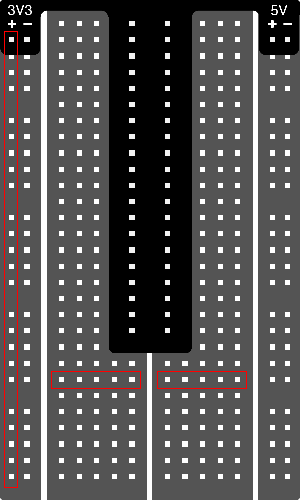

A breadboard allows you to wire up circuits by plugging in components and wires into the holes of the board. Components are connected together by being either on the same column if they are plugged into the outer two columns of the board or by being on the same row if they are plugged into the inner 10 columns of the board included in the Canakit Pi starter kit. The red rectangles above outline rows and columns that are physically connected together.

The breadboard used in this workshop has a breakout board attached to it that a ribbon cable will be plugged into. This connects the input/output (I/O) pins of the Pi to our breadboard with easy-to-read labels. This particular breakout board routes the voltage and ground lines to the outer two columns of the breadboard – a nice convenience.

> Tip: Make sure the 40-pin ribbon cable connector is connected in the correct orientation, as in the picture above. The red wire should be closest to the short edge of the pi case.

> **NOTE:** Make sure that your ribbon cable is plugged into your pi on both rows of pins. Otherwise, it won't work properly! If your Canakit came with the black pi case, it is really easy to accidentally miss the front or back row.

> NOTE: The Raspberry Pi is a 3.3V (3V3) device, and the breakout board allows you to connect directly to the CPU on the Pi. You should only connect low power 3V3 devices directly to your Pi. Anything else (5V, or more than 48 mA total) could damage your Pi, so be careful what you attach! 

[<< Part 3. Buttons & Lights](Part-3.-Buttons-&-Lights) - [Part 3. Input Button >>](Part-3.-Input-Button)

