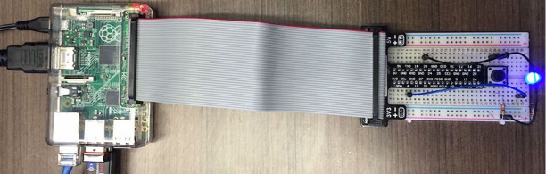

##Overview

One of the coolest aspects of the Pi is that we can build and attach circuits that it can talk to. We are going to use a breadboard to quickly build circuits that can be controlled from simple Python scripts running on the Pi. We will build a circuit that drives an input into the Pi, a button, as well as a circuit that the Pi drives as an output, a LED. Each circuit will have a simple Python script that we will run to control it.

> **NOTE:** If you are running this tutorial from a fresh install (in other words, you are not physically at a workshop ... if you are then this has already been done for you, and you can skip ahead to the next page), clone all of the Python scripts with the following command:
```
$ cd ~
$ git clone https://github.com/InitialState/piot-101.git piot
```

This Section will cover:

- [Breadboard Basics](Part-3.-Breadboard-Basics)
- [Input Button](Part-3.-Input-Button)
- [Reading The Button](Part-3.-Reading-the-Button)
- [Adding an LED](Part-3.-Adding-an-LED)

[<< Part 2. Python + Nano](Part-2.-Python+Nano) - [Part 3. Breadboard Basics >>](Part-3.-Breadboard-Basics)