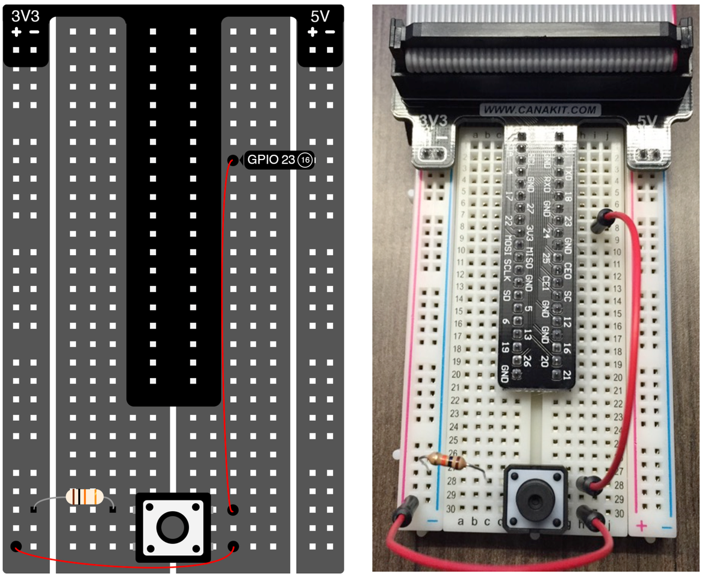

Before we build our first circuit, let’s shutdown our Pi to keep it safe. 

> **IMPORTANT**: _Always build your circuit with the Pi shutdown and the power cord disconnected_.

In the command prompt, type:

```
$ sudo shutdown -h now
```

The “sudo” prefix will run the command as a “super user”. Only administrators (i.e. super users) can shutdown the Pi this way. Do not simply yank the power cord out as this can corrupt the file system. Once the shutdown sequence has completed, remove the power cord from the micro USB port of the Pi.

Now we are ready to build our first circuit. For this circuit, you will need a button, a 10K ohm resistor (match the color of the resistor shown above), and two jumper wires. Attach a jumper wire between the top right pin of the button to pin 23. Attach the top left pin of the button to ground through the resistor (this will be a “pull- down” resistor). Attach the bottom right pin of the button to 3.3V. Ensure all pins and wires are firmly seated into the breadboard (especially the button, which can require a bit of force to sit flush into the breadboard). The wiring diagram and a photo of what your breadboard should look like can be found above.

When we press the button, the circuit that connects the 3.3V line into pin 23 will close. This will be received by the Pi as a digital logic ‘1’. When the button is not being pressed, there is no voltage connected to pin 23. In this case, the Pi will see the input as a digital logic ‘0’ coming into pin 23.

Plug the ribbon cable into your Pi and power it on once you have finished wiring up the button.

> Tip: There is a guide inside your Canakit box that shows you how to read resistor values from the color-coding.

[<< Part 3: Breadboard Basics](Part-3.-Breadboard-Basics) - [Part 3: Reading the Button >>](Part-3.-Reading-the-Button)