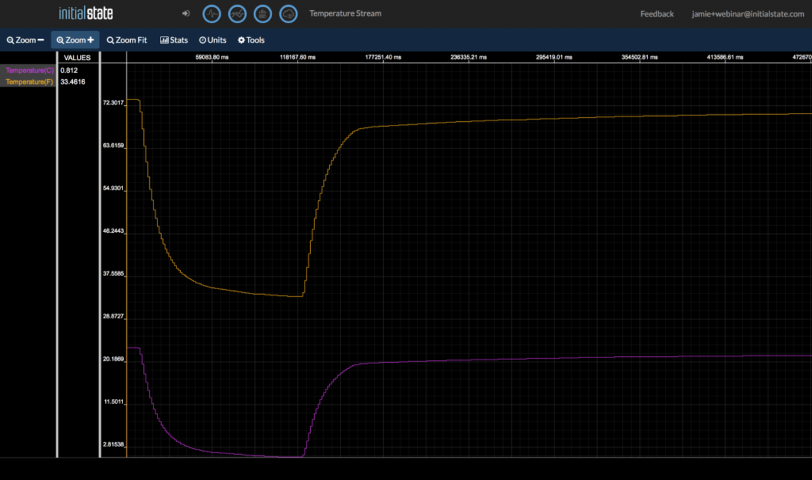

Everything is now ready for us to start streaming data. In the piot directory, there is a script called temperature.py that we will use. We will have to make one modification to this script to get it to work.

```
$ nano temperature.py
```

**temperature.py**

```python
import os
import glob
import time
from ISStreamer.Streamer import Streamer

streamer = Streamer(bucket_name="Temperature Stream", bucket_key="piot_temp_stream031815", access_key="PUT_YOUR_ACCESS_KEY_HERE")

os.system('modprobe w1-gpio')
os.system('modprobe w1-therm')

base_dir = '/sys/bus/w1/devices'
device_folder = glob.glob(base_dir + '28*')[0]
device_file = device_folder + '/w1_slave'

def read_temp_raw():
    f = open(device_file, 'r')
    lines = f.readlines()
    f.close()
    return lines


def read_temp():
    lines = read_temp_raw()
    while lines[0].strip()[-3:] != 'YES':
        time.sleep(0.2)
        lines = read_temp_raw()
    equals_pos = lines[1].find('t=')
    if equals_pos != -1:
        temp_string = lines[1][equals_pos+2:]
        temp_c = float(temp_string) / 1000.0
        return temp_c

while True:
    temp_c = read_temp()
    temp_f = temp_c * 9.0 / 5.0 + 32.0
    streamer.log("temperature(C)", temp_c)
    streamer.log("temperature(F)", temp_f)
    time.sleep(.5)
```

You need to put your Initial State access key on line 6 in place of `PUT_YOUR_ACCESS_KEY_HERE`.

Line 6 will create a bucket named “Temperature Stream” in your Initial State account (assuming you correctly specified your access_key on this same line). Lines 8 through 30 of this script simply interface with the DS18B20 sensor to read its temperature from the w1_slave file we discussed earlier. The read_temp_raw() function on line 15 reads the raw w1_slave file. The read_temp() function on line 21 parses out the temperature from that file. Line 34 calls these functions to get the current temperature. Line 35 converts the temperature from Fahrenheit to Celsius. Lines 35 and 36 streams the temperature to your Initial State account. Line 37 pauses the script for 0.5 seconds, setting how often the temperature sensor will be read and streamed.

> Tip: a detailed explanation of how the DS18B20 works can be found at [https://learn.adafruit.com/adafruits-raspberry-pi-lesson-11-ds18b20- temperature-sensing/hardware](https://learn.adafruit.com/adafruits-raspberry-pi-lesson-11-ds18b20- temperature-sensing/hardware)

We are ready to start streaming. Run the following command:

```
$ sudo python temperature.py
```

Go back to your Initial State account in your web browser and look for a new data bucket called Temperature Stream (you may need to refresh your browser). Open this data stream in Lines. You should see temperature data streaming in live. Vary the temperature of the sensor by holding it in your hand or putting it in a glass of ice. An example temperature stream is shown below.




[<< Part 4: Initial State](Part-4.-Initial-State) - [Part 5: Magnetic Contact Switch >>](Part-5.-Magnetic-Contact-Switch)