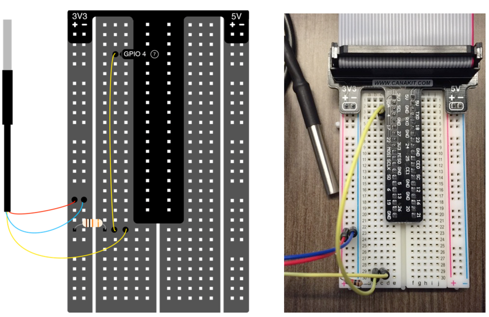

The DS18B20 has three wires. The red wire connects to 3.3V. The blue/black wire connects to ground. The yellow wire connects to a pull-up resistor/pin 4.

> If you have a DS18B20 that has red/black/blue wires, red to 3.3V, black to ground, and blue to pull-up resistor/pin 4.

_Make sure your Pi is powered off before putting together your circuit._

[<< Part 4: IoT Temperature Sensor](Part-4.-IoT-Temperature-Sensor) - [Part 4: Making Sure the DS18B20 Works >>](Part-4.-Making-Sure-the-DS18B20-Works)