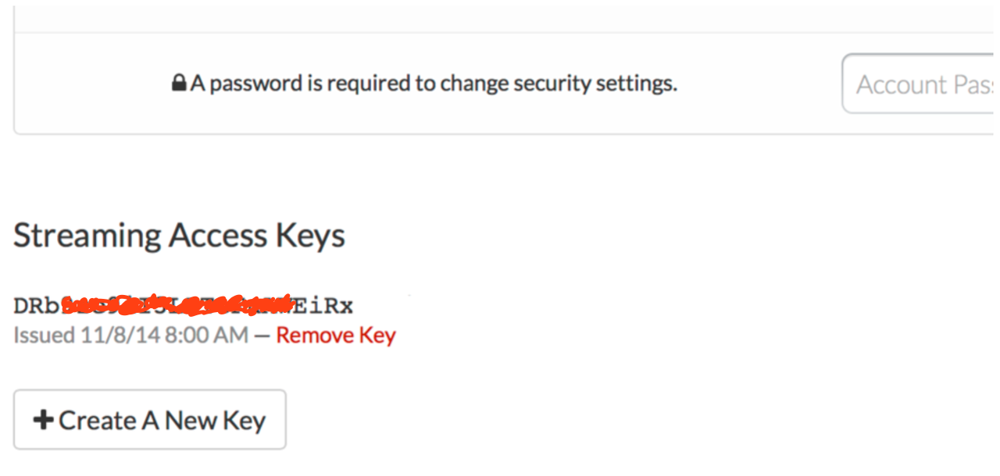
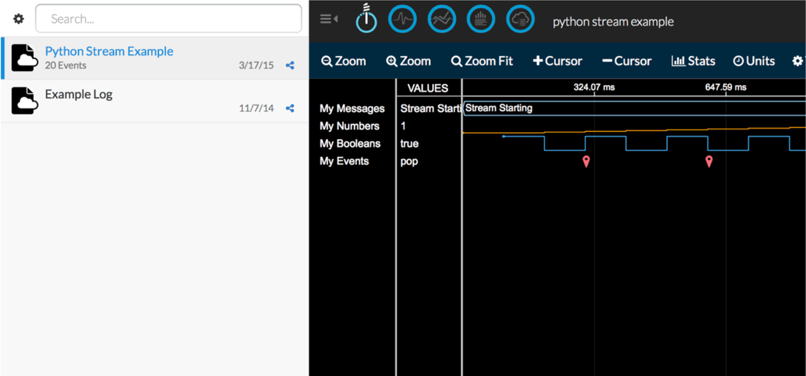

We not only want to see what the current temperature is from our DS18B20 sensor, but we want to stream the temperature to a cloud service so we can see a pretty visualization of the current and past temperature data. Our temperature data needs a destination. We will use Initial State as that destination.

###Step 1: Register for Initial State Account
Go to [https://www.initialstate.com/app#/register/](https://www.initialstate.com/app#/register/) and create a new account.

###Step 2: Install the ISStreamer
Install the Initial State Python module onto your Pi. At a command prompt (don’t forget to SSH into your Pi first), run the following command:

```
$ \curl -sSL https://get.initialstate.com/python -o - | sudo bash
```

###Step 3: Make some Automagic

After Step 2 you will see something similar to the following output to the screen:

```
pi@raspberrypi ~ $ \curl -sSL https://get.initialstate.com/python -o - | sudo bash
Password:
Beginning ISStreamer Python Easy Installation!
This may take a couple minutes to install, grab some coffee :)
But don't forget to come back, I'll have questions later!

Found easy_install: setuptools 1.1.6
Found pip: pip 1.5.6 from /Library/Python/2.7/site-packages/pip-1.5.6- py2.7.egg (python 2.7)
pip major version: 1
pip minor version: 5
ISStreamer found, updating...
Requirement already up-to-date: ISStreamer in /Library/Python/2.7/site-packages
Cleaning up...
Do you want automagically get an example script? [y/N]
```
When prompted to automatically get an example script, type y. This will create a test script that we can run to ensure that we can stream data to Initial State from our Pi. You will be prompted:

```
Where do you want to save the example? [default: ./is_example.py]: 
```

You can either type `./is_example.py` or hit enter to accept the default.

You will be prompted for your username and password that you just created when you registered your Initial State account. Enter both and the installation will complete.

###Step 4: Access Keys
Let’s take a look at the example script that was created.



```
$ nano is_example.py
```

On line 15, you will see a line that starts with `streamer = Streamer(bucket_ ...`. This lines creates a new data bucket named “Python Stream Example” and is associated with your account. This association happens because of the `access_key=”...”` parameter on that same line. That long series of letters and numbers is your Initial State account access key. If you go to your Initial State account in your web browser, click on your username in the top right, then go to “my account”, you will find that same access key at the bottom of the page under “Streaming Access Keys”.



Every time you create a data stream, that access key will direct that data stream to your account (so don’t share your key with anyone).

###Step 5: Run the Example
Run the test script to make sure we can create a data stream to your Initial State account. Run the following:

```
$ python is_example.py
```

###Step 6: Profit
Go back to your Initial State account in your web browser. A new data bucket called “Python Stream Example” should have shown up on the left in your log shelf (you may have to refresh the page). Click on this bucket and then click on the Waves icon to view the test data.



You will want to step through the Waves tutorial to familiarize yourself with how to use this data visualization tool. You are now ready to start streaming real data from your Pi.

[<< Part 4: Making Sure the DS18B20 Works](Part-4.-Making-Sure-the-DS18B20-Works) - [Part 4: A Live IoT Data Stream >>](Part-4.-A-Live-IoT-Data-Stream)