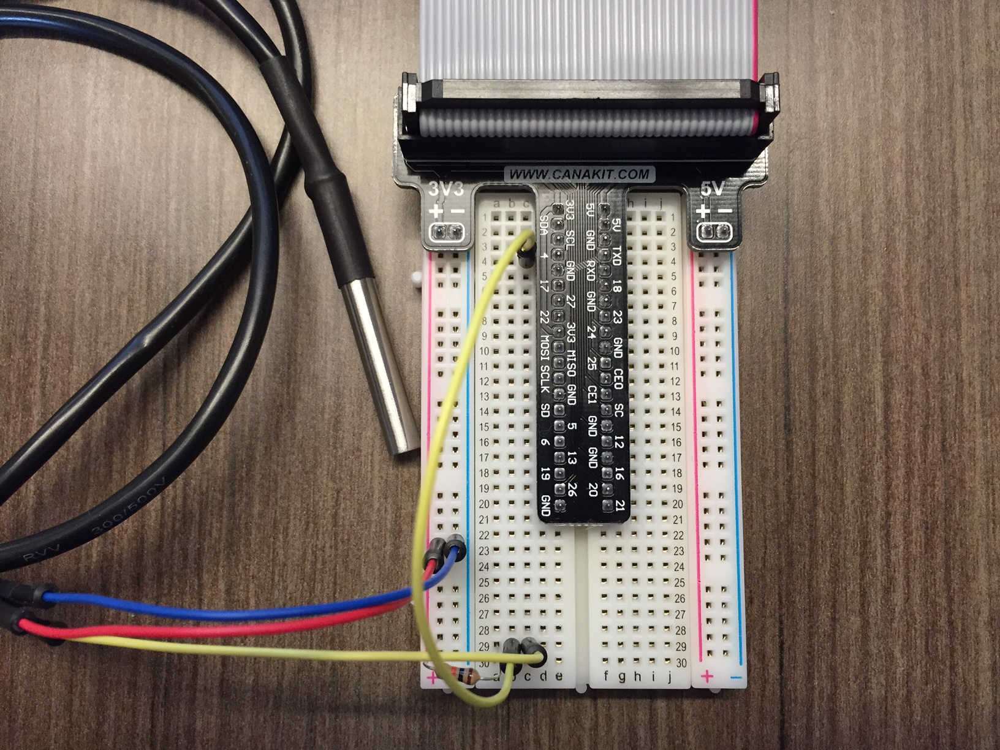

##Overview

We made a “Hello World!” Python script in [Section 2](Part-2.-Hello-World). Setting up a Pi to stream temperature to a cloud service is quickly becoming the de facto IoT “Hello World!” project.

The DS18B20 temperature sensor works well with the Raspberry Pi because it has a digital output, and the Pi has no on-board analog to digital convertors (ADC). Raspbian includes an interface to read the output of the sensor. We just have to write a little code to grab and parse out the temperature.

> **NOTE:** To ensure you have the latest code samples, ensure you've performed a `git pull` in your code directory. If you are working out of your own fork, make sure you merge any upstream changes.

This Section will cover:

- [Hardware Setup](Part-4.-Hardware-Setup)
- [Making Sure the DS18B20 Works](Part-4.-Making-Sure-the-DS18B20-Works)
- [Initial State](Part-4.-Initial-State)
- [A Live IoT Data Stream](Part-4.-A-Live-IoT-Data-Stream)

[<< Part 3: Adding an LED](Part-3.-Adding-an-LED) - [Part 4: Hardware Setup >>](Part-4.-Hardware-Setup)