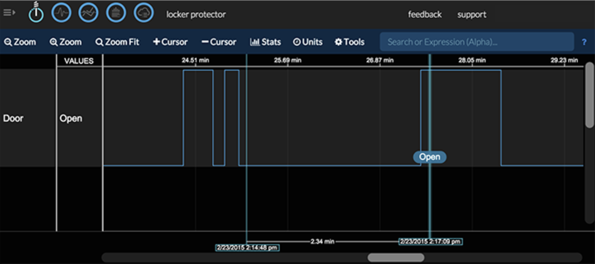

In order to stream, you need to uncomment any lines with the word “streamer” at the beginning. Simply delete the `#` and print statements and change `YOUR_ACCESS_KEY_HERE` to the Initial State access_key that you used earlier.

Save the file and run it to begin streaming.

```
$ sudo python door.py
```

Go back to your Initial State account in your web browser and look for a new data bucket called Locker Protector (you may need to refresh your browser). Open this data stream in Waves. Move your contact switch apart and together to see “Open” messages streaming in live. An example stream is shown below.



[<< Part 5: Making Sure the Switch Works](Part-5.-Making-Sure-the-Switch-Works)