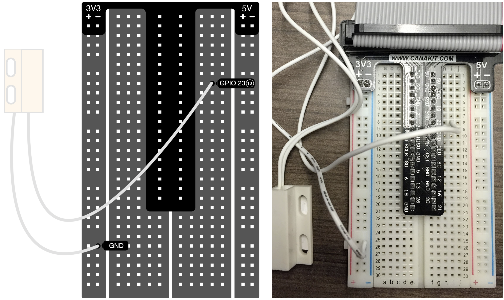

The magnetic contact switch has 2 wires and it doesn’t matter which one goes where. You just want to make sure that one wire is going to one of the Raspberry Pi’s GPIO pins (in this case, GPIO 23/pin 16) and the other wire is connected to ground.

_Make sure your Pi is powered off before putting together your circuit._

[<< Part 5: Magnetic Contact Switch](Part-5.-Magnetic-Contact-Switch) - [Part 5: Making Sure the Switch Works >>](Part-5.-Making-Sure-the-Switch-Works)