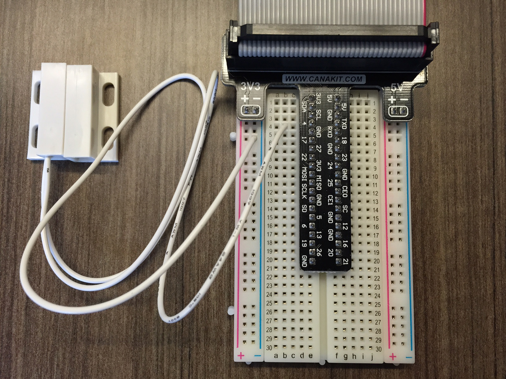

##Overview

Another popular IoT project application is security. Personal surveillance camera systems and motion detectors are becoming increasingly easy and cheap to setup. We’re going to take a step in that direction by using a magnetic contact switch as a door sensor.

We learned how to collect data from a temperature sensor in Part 4 – collecting from the door sensor is even more simple. One side of the sensor has a switch that is closed whenever the other side, which has a magnet, is brought within range. You can detect whether or not the switch is closed, which means that we can see if something (like a door or lid) is open or closed.

> **NOTE:** To ensure you have the latest code samples, ensure you've performed a `git pull` in your code directory. If you are working out of your own fork, make sure you merge any upstream changes.

This Section will cover:

- [Hardware Setup](Part-5.-Hardware-Setup)
- [Making Sure the Switch Works](Part-5.-Making-Sure-the-Switch-Works)
- [A Live Security Data Stream](Part-5.-A-Live-Security-Data-Stream)

[<< Part 4: A Live IoT Data Stream](Part-4.-A-Live-IoT-Data-Stream) - [Part 5: Hardware Setup >>](Part-5.-Hardware-Setup)